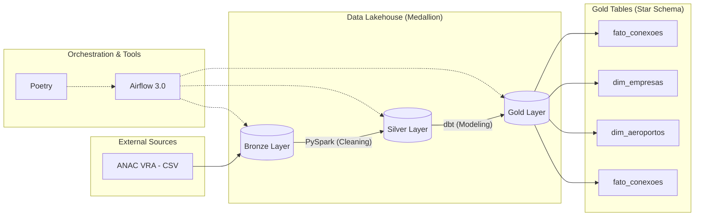

# GRU Connect Analytics ✈️📊

O **GRU Connect Analytics** é uma plataforma de Engenharia de Dados ponta a ponta (E2E) projetada para analisar o risco de conexões de passageiros no Aeroporto Internacional de Guarulhos (GRU/SBGR).

O projeto transforma dados brutos da ANAC em inteligência logística, permitindo identificar gargalos operacionais e janelas críticas de conexão através de um pipeline moderno e escalável.

---

## 🏗️ Arquitetura do Projeto

O pipeline segue os princípios de **Data Lakehouse** utilizando a arquitetura medalhão:



---

## 🚀 Contexto de Negócio

O sucesso de um hub aeroportuário depende do **Minimum Connect Time (MCT)**. Conexões com intervalo reduzido possuem alto risco de perda de voo. Este projeto identifica essas janelas críticas cruzando dados oficiais da ANAC (VRA), permitindo uma visão preditiva sobre a eficiência logística das companhias aéreas.

### 🔧 Lógica de Negócio (MCT Risk)

A tabela `fato_conexoes` classifica automaticamente cada par de voos baseado no tempo em solo:

* 🔴 **RISCO CRÍTICO:** Janela de conexão inferior a 60 minutos.
* 🟡 **RISCO MÉDIO:** Janela de conexão entre 60 e 120 minutos.
* 🟢 **SEGURO:** Janela de conexão superior a 120 minutos.

> **Visualização do Output Final (Camada Gold):**
> *Exemplo de processamento indicando o nível de risco por conexão.*

---

## 🛠️ Stack Tecnológica

| Componente | Tecnologia |
| --- | --- |
| **Engine de Processamento** | Apache Spark (PySpark) |
| **Modelagem Analítica** | dbt-spark (v1.11) |
| **Orquestrador** | Apache Airflow 3.0 (Standalone mode) |
| **Gerenciador de Pacotes** | Poetry |
| **Linguagem** | Python 3.10+ |
| **Formato de Arquivo** | Parquet |

---

## ✅ Orquestração (Airflow 3.0)

O pipeline é totalmente automatizado via Airflow, garantindo a execução sequencial e o tratamento de erros em cada camada (Bronze ➡️ Silver ➡️ Gold).

> **Visualização da DAG (Graph View):**
> *Fluxo de tarefas automatizado garantindo a integridade do Lakehouse.*

---

## 📖 Documentação e Linhagem (dbt)

Para garantir a transparência e governança, utilizamos a documentação nativa do dbt, que gera o dicionário de dados e o grafo de linhagem automática.

> **Grafo de Linhagem (Lineage Graph):**
> *Rastreabilidade completa desde os dados crus até os indicadores de negócio.*

### Como visualizar a documentação localmente:

```bash
cd dbt_gru
poetry run dbt docs generate
poetry run dbt docs serve --port 8081

```

---

## ⚙️ Como Executar

### 1. Instalação

```bash
# Clonar o repositório
git clone https://github.com/paco-saavedra/gru-connect-analytics.git
cd gru-connect-analytics

# Instalar dependências com Poetry
poetry install

```

### 2. Subir Airflow

```bash
export AIRFLOW_HOME=$(pwd)/airflow
poetry run airflow standalone

```

* **URL:** `localhost:8080`
* **User:** `admin`
* **Password:** `admin`

---

## 👨‍💻 Autor

**Paco de Oliveira Saavedra**
Este projeto foi desenvolvido como um portfólio de Engenharia de Dados avançada.

