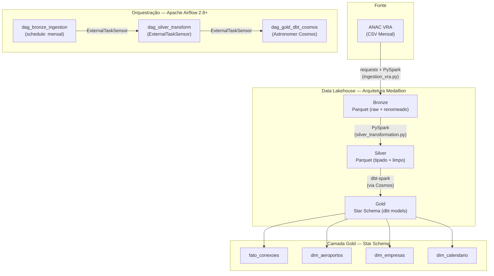

# GRU Connect Analytics ✈️

> **End-to-End Data Engineering Portfolio** — análise de risco de conexões de passageiros no Aeroporto Internacional de Guarulhos (GRU/SBGR) usando dados oficiais da ANAC.


---

## Contexto de Negócio

O sucesso de um hub aeroportuário depende do **Minimum Connect Time (MCT)** — o tempo mínimo para um passageiro desembarcar, transitar e embarcar em um voo de conexão. Este projeto analisa os dados reais de voos da ANAC (VRA) para classificar automaticamente cada par de conexão em GRU:

| Status | Janela de Conexão | Risco |
|--------|:-----------------:|-------|
| 🔴 **Risco Crítico** | < 60 min | Alto risco de miss-connection |
| 🟡 **Risco Médio** | 60 – 90 min | Conexão viável mas sob pressão |
| 🟢 **Seguro** | ≥ 90 min | Conexão confortável |

---

## Arquitetura


```mermaid
graph TD
    subgraph Fonte
        ANAC["ANAC VRA\n(CSV Mensal)"]
    end

    subgraph Airflow["Orquestração — Apache Airflow 2.8+"]
        DAG_B["dag_bronze_ingestion\n(schedule: mensal)"]
        DAG_S["dag_silver_transform\n(ExternalTaskSensor)"]
        DAG_G["dag_gold_dbt_cosmos\n(Astronomer Cosmos)"]
        DAG_B -->|ExternalTaskSensor| DAG_S
        DAG_S -->|ExternalTaskSensor| DAG_G
    end

    subgraph Lakehouse["Data Lakehouse — Arquitetura Medallion"]
        BRONZE["Bronze\nParquet (raw + renomeado)"]
        SILVER["Silver\nParquet (tipado + limpo)"]
        GOLD["Gold\nStar Schema (dbt models)"]
        BRONZE -->|"PySpark\n(silver_transformation.py)"| SILVER
        SILVER -->|"dbt-spark\n(via Cosmos)"| GOLD
    end

    subgraph Gold_Tables["Camada Gold — Star Schema"]
        FATO["fato_conexoes"]
        D1["dim_aeroportos"]
        D2["dim_empresas"]
        D3["dim_calendario"]
        GOLD --> FATO
        GOLD --> D1
        GOLD --> D2
        GOLD --> D3
    end

    ANAC -->|"requests + PySpark\n(ingestion_vra.py)"| BRONZE
```

### Por que Astronomer Cosmos?

O Cosmos converte o grafo de dependências do dbt diretamente em tasks individuais do Airflow. Isso significa que cada model dbt (`stg_anac_vra`, `dim_aeroportos`, `fato_conexoes`, etc.) tem seu próprio log, retry e estado no Airflow — permitindo debugging granular e maior observabilidade.

```
# Sem Cosmos: 1 BashOperator "dbt run"
[dbt_run_gold]

# Com Cosmos: linhagem real no Airflow
[stg_anac_vra] → [dim_aeroportos] → [fato_conexoes]
              → [dim_empresas]   ↗
              → [dim_calendario] ↗
```

---

## Stack Tecnológica

| Camada | Tecnologia |
|--------|-----------|
| Ingestão & Processamento | PySpark 3.5 |
| Modelagem Analítica | dbt-spark 1.8 |
| Orquestração | Apache Airflow 2.8 |
| Integração dbt↔Airflow | **Astronomer Cosmos 1.7** |
| Qualidade de Dados | dbt tests (not_null, unique, accepted_values) |
| Formato de Armazenamento | Parquet (Snappy) |
| Linting | Ruff |
| Gerenciador de Pacotes | Poetry |

---

## Estrutura do Projeto

```
gru-connect-analytics/
├── dags/
│   ├── dag_bronze_ingestion.py   # Bronze: download + ingestão PySpark
│   ├── dag_silver_transform.py   # Silver: limpeza e tipagem PySpark
│   └── dag_gold_dbt_cosmos.py    # Gold: modelagem dbt via Cosmos
├── spark_jobs/
│   ├── ingestion_vra.py          # Lógica de download e ingestão Bronze
│   ├── silver_transformation.py  # Transformações Silver
│   └── inspect_gold.py           # Utilitário de inspeção Gold
├── dbt_gru/
│   └── models/
│       ├── staging/
│       │   ├── stg_anac_vra.sql  # Staging VRA
│       │   └── schema.yml        # Testes de qualidade
│       └── marts/
│           ├── fato_conexoes.sql
│           ├── dim_aeroportos.sql
│           ├── dim_empresas.sql
│           ├── dim_calendario.sql
│           └── schema.yml        # Testes e documentação
├── .env.example                  # Variáveis de ambiente necessárias
└── pyproject.toml                # Dependências (Poetry)
```

---

## Quick Start

### 1. Pré-requisitos

- Python 3.10+
- Java 11+ (necessário para PySpark)
- Poetry

### 2. Instalação

```bash
git clone https://github.com/paco-saavedra/gru-connect-analytics.git
cd gru-connect-analytics

# Copiar e configurar variáveis de ambiente
cp .env.example .env
# Editar GRU_BASE_DIR no .env com o path do projeto

# Instalar dependências
poetry install
```

### 3. Configurar variável de ambiente

```bash
export GRU_BASE_DIR=$(pwd)
```

### 4. Subir Airflow

```bash
export AIRFLOW_HOME=$(pwd)/airflow
poetry run airflow standalone
```

Acesse: `http://localhost:8080` (usuário: `admin`)

### 5. Executar manualmente (sem Airflow)

```bash
# Bronze
python spark_jobs/ingestion_vra.py --ano 2025 --mes 01

# Silver
python spark_jobs/silver_transformation.py

# Gold (dbt)
cd dbt_gru
poetry run dbt run --profiles-dir . --full-refresh

# Inspecionar resultados
python spark_jobs/inspect_gold.py
```

### 6. Documentação dbt

```bash
cd dbt_gru
poetry run dbt docs generate
poetry run dbt docs serve --port 8081
```

Acesse: `http://localhost:8081` — inclui grafo de linhagem completo.

---

## Modelo de Dados (Gold — Star Schema)

```
dim_calendario ─┐
dim_aeroportos ─┤
dim_empresas   ─┼──► fato_conexoes
                │      - cd_icao_empresa
                │      - nr_voo_chegada
                │      - nr_voo_partida
                │      - janela_conexao_min
                └──────- desc_status_risco
```

---

## Autor

**Paco de Oliveira Saavedra** — [GitHub](https://github.com/paco-saavedra)

Projeto de portfólio avançado de Engenharia de Dados, demonstrando pipeline E2E com dados reais do setor de aviação civil brasileiro.
