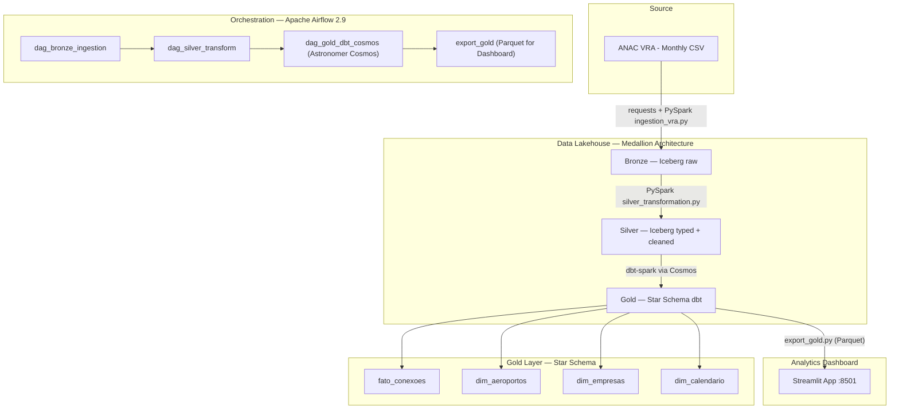

# GRU Connect Analytics

> **End-to-End Data Engineering Portfolio** — passenger connection risk analysis at Guarulhos International Airport (GRU/SBGR) using official ANAC data.


---

## Business Context

The success of an airport hub depends on the **Minimum Connect Time (MCT)** — the shortest time for a passenger to deplane, transit, and board a connecting flight. This project analyses real ANAC flight data (VRA) to automatically classify every connection pair at GRU:

| Status | Connection Window | Risk |
|--------|:-----------------:|------|
| **Critical Risk** | < 60 min | High miss-connection probability |
| **Medium Risk** | 60 – 90 min | Feasible but under pressure |
| **Safe** | >= 90 min | Comfortable connection |

---

## Architecture

<!-- Add your architecture diagram below by replacing the placeholder:
     1. Save your image to docs/architecture.png (or any path you prefer)
     2. Replace the img tag with: 
-->
<p align="center">
  
</p>


```mermaid
graph TD
    subgraph Source
        ANAC["ANAC VRA - Monthly CSV"]
    end

    subgraph Airflow["Orchestration — Apache Airflow 2.9"]
        DAG_B["dag_bronze_ingestion"]
        DAG_S["dag_silver_transform"]
        DAG_G["dag_gold_dbt_cosmos (Astronomer Cosmos)"]
        DAG_E["export_gold (Parquet for Dashboard)"]
        DAG_B --> DAG_S
        DAG_S --> DAG_G
        DAG_G --> DAG_E
    end

    subgraph Lakehouse["Data Lakehouse — Medallion Architecture"]
        BRONZE["Bronze — Iceberg raw"]
        SILVER["Silver — Iceberg typed + cleaned"]
        GOLD["Gold — Star Schema dbt"]
        BRONZE -->|"PySpark silver_transformation.py"| SILVER
        SILVER -->|"dbt-spark via Cosmos"| GOLD
    end

    subgraph Dashboard["Analytics Dashboard"]
        ST["Streamlit App :8501"]
        GOLD -->|"export_gold.py (Parquet)"| ST
    end

    subgraph Gold_Tables["Gold Layer — Star Schema"]
        FATO["fato_conexoes"]
        D1["dim_aeroportos"]
        D2["dim_empresas"]
        D3["dim_calendario"]
        GOLD --> FATO
        GOLD --> D1
        GOLD --> D2
        GOLD --> D3
    end

    ANAC -->|"requests + PySpark ingestion_vra.py"| BRONZE
```

### Why Astronomer Cosmos?

Cosmos converts the dbt dependency graph directly into individual Airflow tasks. Each dbt model (`dim_aeroportos`, `dim_empresas`, `dim_calendario`, `fato_conexoes`) has its own log, retry, and state in Airflow — enabling granular debugging and full observability.

```
# Without Cosmos: 1 BashOperator "dbt run"
[dbt_run_gold]

# With Cosmos: real lineage in Airflow
  [dim_aeroportos] → [fato_conexoes]
  [dim_empresas]   ↗
  [dim_calendario] ↗
```

---

## Dashboard

The project includes an interactive **Streamlit dashboard** that visualizes connection risk data from the Gold layer.

<!-- Add your dashboard screenshots here:


-->

**Features:**
- **Overview** — KPIs (total connections, critical %, avg window), risk distribution chart, airline ranking
- **Flight Search** — search connections by flight number, airline, or risk level
- **Airlines Analysis** — risk breakdown per airline with stacked bar charts

---

## Tech Stack

| Layer | Technology |
|-------|-----------|
| Ingestion & Processing | PySpark 3.5 |
| Storage Format | **Apache Iceberg 1.5** (ACID, Time Travel, Schema Evolution) |
| Analytical Modeling | dbt-spark 1.8 |
| Orchestration | Apache Airflow 2.9 |
| dbt-Airflow Integration | **Astronomer Cosmos 1.7** |
| Data Quality | dbt tests (not_null, unique, accepted_values) |
| Dashboard | **Streamlit** (Plotly charts, flight search) |
| Containerization | Docker Compose (Airflow + Spark + Postgres + Streamlit) |
| CI/CD | GitHub Actions (lint + dbt validate + pytest) |
| Linting | Ruff |

---

## Project Structure

```
gru-connect-analytics/
├── dags/
│   ├── dag_bronze_ingestion.py   # Bronze: ANAC download + PySpark ingestion
│   ├── dag_silver_transform.py   # Silver: typing and cleaning via PySpark
│   └── dag_gold_dbt_cosmos.py    # Gold: dbt models via Cosmos + export to Parquet
├── spark_jobs/
│   ├── ingestion_vra.py          # Download and Bronze ingestion logic
│   ├── silver_transformation.py  # Silver transformations
│   ├── export_gold.py            # Export Iceberg Gold → Parquet for dashboard
│   └── inspect_gold.py           # Gold inspection utility
├── streamlit_app/
│   ├── app.py                    # Interactive dashboard (KPIs, search, charts)
│   └── .streamlit/config.toml    # Dark theme configuration
├── dbt_gru/
│   └── models/
│       ├── staging/
│       │   ├── stg_anac_vra.sql  # Staging view over Silver Iceberg table
│       │   └── schema.yml        # Quality tests
│       └── marts/
│           ├── fato_conexoes.sql
│           ├── dim_aeroportos.sql
│           ├── dim_empresas.sql
│           ├── dim_calendario.sql
│           └── schema.yml        # Tests and documentation
├── scripts/
│   ├── docker-init.sh            # Bootstrap: DB migrate + admin user + Spark connection
│   └── backfill.sh               # Multi-month VRA ingestion utility
├── docs/
│   └── architecture.png          # ← Add your architecture diagram here
├── Dockerfile.airflow            # Airflow image (Java + PySpark + dbt + Cosmos)
├── Dockerfile.streamlit          # Dashboard image (lightweight Python)
├── docker-compose.yml            # Full stack: Airflow + Spark + Postgres + Streamlit
├── .env.example                  # Required environment variables
└── pyproject.toml                # Python dependencies
```

---

## Quick Start

### Prerequisites

- Docker and Docker Compose

### 1. Clone and configure

```bash
git clone https://github.com/Pacodeoliv/gru-connect-analytics.git
cd gru-connect-analytics
cp .env.example .env
```

Edit `.env` if needed (defaults work out of the box):

```bash
AIRFLOW_UID=1000          # your Linux UID — run: echo $(id -u)
POSTGRES_PASSWORD=airflow
```

### 2. Start the stack

```bash
docker compose up -d
```

> **Note:** First startup takes ~5 minutes while Airflow initialises the database, downloads the Iceberg JAR, and scans providers. Subsequent restarts are much faster.

### 3. Access the UIs

| Service | URL | Credentials |
|---------|-----|-------------|
| **Dashboard** | [http://localhost:8501](http://localhost:8501) | — |
| **Airflow UI** | [http://localhost:8080](http://localhost:8080) | admin / admin |
| **Spark Master UI** | [http://localhost:8082](http://localhost:8082) | — |

### 4. Verify the Spark connection

The `spark_default` connection is created automatically on first startup (pointing to the Thrift Server at `spark-master:10000`). If the Gold DAG fails with a connection error, verify it manually:

1. Go to **Admin → Connections** in the Airflow UI
2. Find `spark_default` and click **Edit**
3. Make sure the values are:

| Field | Value |
|-------|-------|
| **Connection Type** | Spark |
| **Host** | `spark-master` |
| **Port** | `10000` |

> This is the Spark **Thrift Server** port used by dbt/Cosmos to submit SQL. It is different from the Spark master submit port (7077).

### 5. Run the pipeline

1. Open the Airflow UI at `http://localhost:8080`
2. Trigger `dag_bronze_ingestion` manually (downloads last 12 months of ANAC VRA data)
3. Once Bronze completes, trigger `dag_silver_transform` (types and cleans the data)
4. Once Silver completes, trigger `dag_gold_dbt_cosmos` (runs dbt models + exports to Parquet)
5. The `export_gold` task runs last — once done, the **Dashboard** is populated

> You can also trigger DAGs from the CLI:
> ```bash
> docker compose exec airflow-webserver \
>   airflow dags trigger dag_bronze_ingestion
> ```

### 6. Generate dbt documentation

```bash
docker compose exec airflow-webserver bash -c \
  "cd /opt/airflow/dbt_gru && dbt docs generate --profiles-dir . && dbt docs serve --port 8081"
```

Access at [http://localhost:8081](http://localhost:8081) — includes the full lineage graph.

---

## Services

| Service | Description | Ports |
|---------|-------------|-------|
| `postgres` | Airflow metadata database (PostgreSQL 15) | 5432 (internal) |
| `airflow-init` | One-shot: DB migration, admin user, Spark connection | — |
| `airflow-webserver` | Airflow UI | 8080 |
| `airflow-scheduler` | DAG scheduling and task execution | — |
| `spark-master` | Apache Spark 3.5 master node + Thrift Server | 7077, 8082, 10000 |
| `spark-worker` | Spark worker (2 cores, 2 GB RAM) | — |
| `streamlit` | Interactive analytics dashboard | 8501 |

---

## Data Model (Gold — Star Schema)

```
dim_calendario ─┐
dim_aeroportos ─┤
dim_empresas   ─┼──► fato_conexoes
                │      - cd_icao_empresa
                │      - nr_voo_chegada
                │      - nr_voo_partida
                │      - janela_conexao_min
                └──────- desc_status_risco
```

---

## Author

**Paco de Oliveira Saavedra** — [GitHub](https://github.com/Pacodeoliv)

Advanced Data Engineering portfolio project, demonstrating an E2E pipeline with real data from the Brazilian civil aviation sector.
